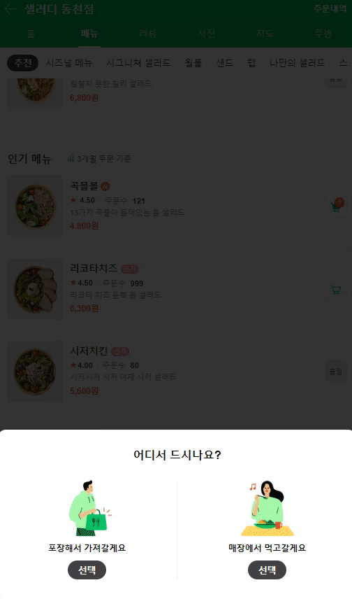
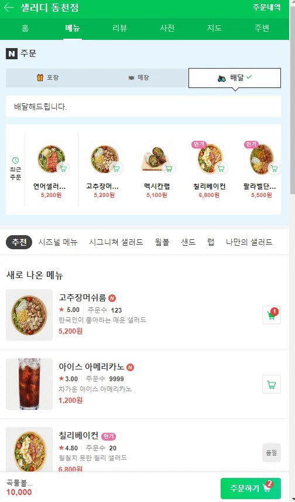

# naver-order-page
## 💁‍♂️ Introducing Project
<center>
  
    
  
</center>

## 🎪 making spec
### 메인화면
> - 새로 나온 메뉴, 인기 메뉴, 시즈널 메뉴 화면 구성
> - drop 메뉴 구현
> - 디테일 화면 이동 가능
> - 주문하기 화면 이동 가능
### 디테일 화면
> - 메인화면에서 샐러드 아마자 클릭했을 때, 디테일 화면 이동
> - 담기 클릭 시 상세 선택 화면 생성
### 메인화면
> - 메인화면에서 주문하기 클릭했을 때, 주문하기 화면 이동
> - 라디오 버튼 활성화 / 비활성화
> - drop 메뉴 구현

## 🛠 Using Skill
> - HTML
> - SCSS
> - Vanilla Javascript


## 📁 Folder Structure
> src
```
├─assets
│  ├─css
│  ├─images : 화면 구성에 필요한 아이콘 등
│  └─scss
│      ├─abstracts : 변수 및 공통 스타일 속성
│      ├─base : css 초기화 파일 등
│      ├─components
│      │  ├─detail : 메뉴 디테일 페이지
│      │  ├─menu : 전체 메뉴 페이지
│      │  └─order : 주문서 페이지
│      └─pages : 페이지 시작시 포장 / 매장 선택
├─data
│  └─images : 샐러드 이미지 데이터
└─src : 자바스크립트 파일
```
## 💾 File Structure
> pages
```
_common.scss

```
> components
```
_amount_select.scss
_go_to_top.scss
_header_area.scss
_menu_item.scss
_modal.scss
```
> detail
```
_menu_detail_area.scss
_menu_review_area.scss
_option_popup_area.scss
```
> menu
```
_menu_category_area.scss
_menu_list_area.scss
_order_box_area.scss
_order_info_area.scss
_order_type.scss
_recent_order_area.scss
```
> order
```
_order_content.scss
_order_content_extra.scss
_order_form_area.scss
```

## 🔧 How To Use?
#### start

```
npm install
```